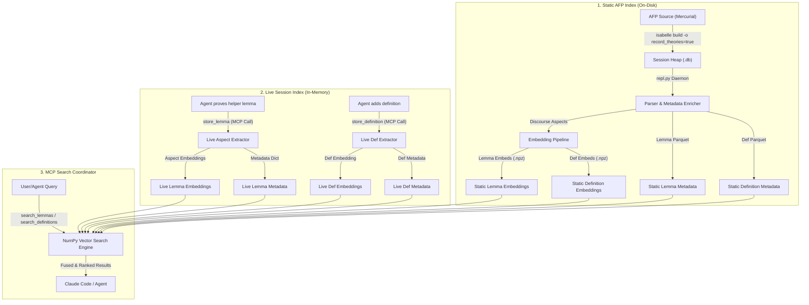

# Technical Report: I/L (Isabelle/Landscape) RAG MCP Server for Isabelle Proof Engineering

This report provides a detailed walkthrough of the implementation, design decisions, and operational details of the **I/L (Isabelle/Landscape) RAG MCP Server** built to assist proof engineering with the **Isabelle/REPL (I/R)** and **Isabelle/Query (I/Q)** agents.

---

## 1. System Architecture & Overview

The I/L (Isabelle/Landscape) system is a Retrieval-Augmented Generation (RAG) assistant that addresses a critical bottleneck in the agent's workflow: token exhaustion and the loss of session context. 

Previously, when the agent attempted a proof, it spent thousands of tokens searching for lemma context and frequently reinvented the wheel by forgetting facts it had already proved in the same session. I/L resolves this via a **two-tier vector index architecture** partitioned into a **Lemma Space** and a **Definition Space**:



### The Two-Tier Index Structure
* **Static AFP Index**: Contains pre-computed aspect embeddings of thousands of lemmas from the Archive of Formal Proofs (AFP) and Isabelle’s standard libraries (e.g. `HOL-Library`). These are compiled offline, serialized as compressed NumPy arrays (`.npz`) and metadata tables (`.parquet`), and loaded into memory on server startup.
* **Live Session Index**: A lightweight, in-memory index that grows dynamically. Whenever the agent successfully completes a proof step, it calls `store_lemma` or `store_definition`, which extracts, embeds, and indexes the new item on the fly. Subsequent searches query both indices, merging and ranking results by cosine similarity.
* **On-Disk Persistence**: To bridge the gap between temporary session-scoped storage and permanent reuse, the system exposes a mechanism to merge the live in-memory session index directly into the static on-disk index via the `persist_session_lemmas` tool. This appends the new lemmas' and definitions' metadata to the static `.parquet` files and stacks their embeddings into the static `.npz` files, ensuring they are loaded in all future agent sessions.

---

## 2. Ingestion Pipeline: Parsing the AFP with Isabelle & REPL

The offline ingestion pipeline extracts structured data from formal proof files. Because Isabelle theories are highly context-sensitive and rely on complex notation, standard text parsers are inadequate. Instead, I/L queries a running **Isabelle Prover session** directly to reconstruct how theories are structured.

### Step 2.1: Building Heaps with Recorded Proof States
By default, Isabelle compiles theories into binary heaps to speed up loading. To parse command boundaries and intermediate states, the sessions must be compiled with the `record_theories` option enabled:
```bash
isabelle build -b -o record_theories=true -d /path/to/edel/external/afp-2025-2/thys -j 8 HOL-Library
```
This tells the Isabelle kernel to record command-by-command source spans and proof state locations inside a SQLite database (`.db`) file adjacent to the PolyML heap.

### Step 2.2: Interacting with the REPL Daemon
We run the Isabelle/REPL daemon (`AutoCorrode/ir/repl.py`) against the compiled heap. The ingestion pipeline connects to this daemon using a TCP socket-based client (`EphemeralReplClient` in [ingest.py](file:///home/correia/edel/edel/il/ingest.py)). 

1. **Retrieve Theories**: The client queries `Ir.theories ();` to list all loaded theories.
2. **Fetch Source Spans**: For each theory, the client runs:
   ```ml
   Ir.source "Theory_Name" 0 ~1;
   ```
   This returns the **entire tokenized source code of the theory file** split into command segments, separated by YXML markup delimiters. Each line contains a leading segment index prefix (e.g., `   2  lemma test1 [simp]: ...`).
3. **Fetch Source Map**: The client requests the structural metadata:
   ```ml
   Ir.source_map "Theory_Name" 0 ~1;
   ```
   This returns a mapping of command indices to keywords, line numbers, offsets, and source files.

### Step 2.3: Grouping Segments into Lemma and Definition Units
Using the source map and segments, the parser (`edel/il/parser.py`) groups sequential commands into logical lemmas and definitions using a state machine:
* **Segment Parsing**: The parser processes the raw string returned by `Ir.source` using regular expressions:
  * `re.match(r'^(\d+)\s', plain)` is used on each line to locate the start of a segment via its index prefix.
  * `re.sub(r'^\s*\d+\s{1,2}', '', ...)` is applied to strip the index prefix from the line, isolating the actual Isabelle source code.
* **Start of an Ingestion Unit**: Detected when a keyword in the source map belongs to either lemmas (`lemma`, `theorem`, `corollary`, `proposition`, `schematic_goal`) or definitions (`definition`, `fun`, `primrec`, `function`, `datatype`, `type_synonym`, `inductive`, `coinductive`, `record`, `abbreviation`).
* **Name Extraction**: Formal names are extracted from the normalized declaration statement using:
  * `extract_lemma_name`: Uses `re.match(r'^(?:lemma|theorem|corollary|proposition|schematic_goal)\s+([a-zA-Z0-9_\'\.]+)(?:\s+\[[^\]]*\])?\s*:', stmt)` to extract names (e.g., `test1` from `lemma test1 [simp]: ...`).
  * `extract_definition_name`: Uses `re.match(rf'^(?:{keyword})\s+([a-zA-Z0-9_\'\.]+)', stmt)` to extract definition/function names (e.g., `test2` from `definition test2 where ...`).
  * If unnamed, a placeholder like `keyword_startoffset` is generated.
* **Proof Collection (for Lemmas)**: Subsequent segments containing proof commands (`by`, `apply`, `proof`, `qed`, `sorry`, `oops`, `done`, `using`, `unfolding`, `from`, `with`, `then`, `hence`, `thus`, `note`, `done`) are gathered as the proof's source code.
* **Termination**: The unit terminates when a finalizing proof command (such as `by`, `qed`, `sorry`, or `oops`) is encountered, or when a new top-level declaration keyword (like `definition`, `fun`, or another `lemma`) begins.

### Step 2.4: Enriching with AFP TOML Metadata
For theories originating in the AFP, the entry name (e.g. `Multiset_Ordering_NPC`) is extracted from the theory name prefix. The `AFPMetadataParser` ([metadata.py](file:///home/correia/edel/edel/il/metadata.py)) parses the corresponding TOML file under `metadata/entries/{entry_name}.toml` to extract entry-level metadata (title, abstract, topics, and authors) which are appended to the lemma's semantic context.

---

## 3. Defining The Four Proof-Oriented Aspects

Isabelle lemmas are embedded into four semantic aspects that form an **epistemic trajectory** through concept space. The four aspects represent the genuinely distinct discourse domains of mathematical proof reasoning — not as a chronological narrative of proof composition, but as the four independent dimensions of mathematical knowledge encoded in a theorem.

Each consecutive pair of aspect embeddings defines a **displacement operator** ($D$). These operators are the primary analytic objects in EDEL theory, measuring the semantic distance traversed between phases of the reasoning process.

```
emb_P ──(D_pm)──► emb_M ──(D_mf)──► emb_F ──(D_fi)──► emb_I
  │                                                        │
  └────────────────── D_pi (epistemic closure) ────────────┘
```

The four aspects form the **vertices of a 3-simplex** (tetrahedron) in embedding space. The shape and volume of this tetrahedron encode the structural complexity of the proof, and intentional degeneracies (when two or more aspects coincide) encode fundamental proof types. This is developed fully in Section 3.3.

---

### 3.1 Statement Parsing: Problem and Interpretation

The `problem` (premises) and `interpretation` (conclusion) aspects are parsed entirely from the lemma's declaration statement — no REPL interaction is required. The parser applies a **four-rule cascade** in priority order:

#### Rule S1 — `obtains`-form (Isar existential witnesses)

Statements containing the `obtains` keyword follow Isabelle's constructive elimination syntax:
```isabelle
lemma foo: assumes "open S" obtains x where "x ∈ S" "0 < x"
```
- `problem` ← the `assumes` clauses before `obtains` (comma-joined)
- `interpretation` ← the `where` clauses (comma-joined)
- If no `assumes` clauses are present, this is a pure existence statement: `problem = interpretation` (fixed point — see Rule S4 below)

This rule is checked *before* `shows` because `assumes` + `obtains` can coexist.

#### Rule S1b — Conditional `assumes`/`shows` form

The standard Isar structured proof statement:
```isabelle
lemma foo: assumes "A" and "B" shows "C"
```
- `problem` ← all `assumes` clauses, comma-joined
- `interpretation` ← the `shows` clause

**Critical fix**: if the `shows` content itself contains `⟹` (e.g. `shows "e > 0 ⟹ ∃d. 0 < d"`), the implication is split *inside* the shows content, and the inner premises are prepended to any outer `assumes` clauses:
```isabelle
lemma square_continuous: fixes e :: real shows "e > 0 ⟹ ∃d. 0 < d ∧ ..."
  → problem = "e > 0", interpretation = "∃d. 0 < d ∧ ..."
```

#### Rule S1c — Standard quoted implication chain

The most common form across HOL theories:
```isabelle
lemma metric_eq_thm: "x ∈ s ⟹ y ∈ s ⟹ x = y ⟷ (∀a∈s. dist x a = dist y a)"
```
- The statement content inside double quotes is split on top-level `⟹` or `==>`, respecting nesting of `()`, `[]`, `{}`, `⟦⟧`, `‹›`.
- All parts except the last become `problem` (comma-joined).
- The last part becomes `interpretation`.
- Bracketed Isabelle premise lists `⟦A; B; C⟧` are automatically unwrapped into `"A, B, C"`.

#### Rule S2a — Strict logical equivalence

If no implication is found, the parser checks for top-level `⟷`, `<->`, or `≡`:
```isabelle
lemma comm_and: "(P ∧ Q) ⟷ (Q ∧ P)"
  → problem = "(P ∧ Q)", interpretation = "(Q ∧ P)"
```
- `problem` ← LHS of the equivalence
- `interpretation` ← RHS of the equivalence

**Epistemic rationale**: an equivalence is a *bidirectional* implication, and `simp` uses it left-to-right as a rewrite rule. The LHS represents the "input pattern" (what you have); the RHS represents the "canonical form" (what you obtain). The displacement $D_{pi}$ encodes the semantic distance between two equivalent representations — a meaningful signal.

#### Rule S2b — Equality as rewrite (heuristic)

Many HOL lemmas use `=` for equational rewriting:
```isabelle
lemma ball_insert: "(∀x∈insert a B. P x) = (P a ∧ (∀x∈B. P x))"
  → problem = "(∀x∈insert a B. P x)", interpretation = "(P a ∧ (∀x∈B. P x))"
```
Top-level `=` is treated as a rewrite split **only when both sides are complex expressions** — i.e., contain spaces, operators, quantifiers, or symbolic characters (`∀`, `∃`, `∧`, `∨`, `∈`, `(`, etc.). Simple variable bindings like `"n = card S"` (where `n` is a plain name) fall through to Rule S4 instead.

This prevents over-splitting definitional assignments while correctly capturing equational rewrites.

#### Rule S4 — Truly unconditional: fixed point

If none of the above rules find a structural split, the statement is **genuinely unconditional** — it asserts something directly without any antecedent:
```isabelle
lemma dist_comm: "dist x y = dist y x"  -- (both sides simple? no: both complex → Rule S2b)
lemma foo: "x = y"                      -- (both sides simple → Rule S4)
  → problem = "x = y", interpretation = "x = y"   -- fixed point
```
- `problem = interpretation = conclusion`
- **Geometric meaning**: the displacement $D_{pi} = \mathbf{0}$. The lemma is a **fixed point** in embedding space — its truth is self-contained, requiring no external premises. Unconditional HOL lemmas cluster by *what they assert*, not by any directional journey.

---

### 3.2 Proof Parsing: Method and Finding

#### Segment Classification

Each proof segment (as reported by `Ir.source_map`) is classified by its Isabelle keyword:

| Aspect | Keyword set |
|--------|-------------|
| `method` (skeleton) | `proof`, `qed`, `have`, `show`, `also`, `finally`, `next`, `case`, `assume`, `fix`, `obtain`, `define`, `let`, `presume`, `suppose` |
| `finding` (tactics) | `apply`, `by`, `using`, `unfolding`, `from`, `with`, `then`, `hence`, `thus`, `note`, `done`, `sorry`, `oops` |

When `Ir.source_map` segments are not directly available (e.g., ingesting from static metadata), a fallback classifier splits `proof_text` line-by-line by keyword membership.

#### Simplex Collapse Rules for Method and Finding

After segment classification, three collapse rules ensure every aspect is always non-empty, and that the resulting geometry is **semantically meaningful** rather than a null-vector artefact:

**Rule M1 — Tactic-only proof** (`method` empty, `finding` present):
```isabelle
lemma foo: "A ⟹ B" by simp
  → method = finding = "by simp"
```
The proof has no declarative structure — it is a single operational step. Setting `method = finding` collapses the M–F edge of the tetrahedron: the proof's *strategy* and its *execution* are indistinguishable.

**Rule M2 — Skeleton-only proof** (`finding` empty, `method` present):
```isabelle
lemma foo: "A ⟹ B"
proof
  show "B" using assms done
qed
  → finding = method = "proof\nshow B\nqed"
```
The proof has full Isar declarative structure but no separate tactic step. Setting `finding = method` applies the same M–F collapse from the other direction.

**Rule M3 — No proof content** (both empty — `sorry`, `oops`, opaque, or axiomatic):
```isabelle
lemma foo: "A ⟹ B" sorry
  → method = finding = interpretation
```
`sorry` and `oops` carry no structural information — they are epistemic voids. The proof content is collapsed to the conclusion (`interpretation`), preserving the lemma's semantic location in embedding space without introducing spurious signal. When this is combined with Rule S4 (unconditional, so `problem = interpretation` too), all four aspects coincide: a **0-simplex** (see Section 3.3).

---

### 3.3 The 3-Simplex Degeneracy Model

The four aspects form the vertices of a tetrahedron in embedding space. When two aspects share the same text, their embeddings coincide, **reducing the simplex dimension**. This degeneracy is intentional and encodes the proof's structural type:

```
Full 3-simplex (tetrahedron):
     P ───── I
    / \     / \
   M ─── F
  All four vertices distinct.
  → Rich Isar proof: premises, intermediate steps,
    tactics, and conclusion are all semantically different.

2-simplex (triangle, M=F edge collapsed):
     P ───── I
      \     /
       M = F
  Method and finding coincide.
  → Tactic-only or skeleton-only proof.

1-simplex (line, P=I and M=F):
  P = I ────── M = F
  Two pairs of vertices coincide.
  → Unconditional lemma proved by a single tactic.
    e.g. "dist x y = dist y x" by simp

0-simplex (point, all coincide):
  P = M = F = I
  All four vertices at the same location.
  → Axiomatic or truly trivial unconditional lemma
    with no proof content.
```

**Validated distribution over 4706 HOL-Analysis lemmas:**

| Simplex dimension | Count | % | Proof type |
|---|---|---|---|
| **3-simplex** (tetrahedron) | 1486 | 31.6% | Full structured Isar proofs |
| **2-simplex** (triangle) | 2625 | 55.8% | Tactic-only or skeleton-only |
| **1-simplex** (line) | 595 | 12.6% | Unconditional + proof content |
| **0-simplex** (point) | 0 | 0.0% | Axiomatic (none in HOL-Analysis) |

The **simplex volume** thus becomes a direct measure of proof structural richness. A large tetrahedron indicates a proof where premises, intermediate reasoning, tactic execution, and conclusion all occupy semantically distant regions — a genuine epistemic journey. A collapsed point indicates a self-evident or axiomatic truth whose location in embedding space is fully determined by its content alone.

### Summary: Aspect Extraction for Each Proof Type

| Proof type | problem (P) | method (M) | finding (F) | interpretation (I) |
|---|---|---|---|---|
| Conditional Isar+tactics | premises | skeleton | tactics | conclusion |
| Conditional, tactic-only | premises | = tactics (M1) | tactics | conclusion |
| Conditional, skeleton-only | premises | skeleton | = skeleton (M2) | conclusion |
| Conditional, no proof | premises | = conclusion (M3) | = conclusion (M3) | conclusion |
| Equivalence `A ⟷ B` | LHS (S2a) | … | … | RHS |
| Equality rewrite (complex=) | LHS (S2b) | … | … | RHS |
| Unconditional (fixed point) | = conclusion (S4) | … | … | conclusion |
| Axiomatic unconditional | = conclusion | = conclusion | = conclusion | conclusion |

---

### 3.4 Aspect Deduplication Optimization

Because the statement parsing rules (S-rules) and proof collapse rules (M-rules) frequently cause multiple aspects of a lemma (or across different lemmas in the database) to contain identical text values (e.g. `P=I` for unconditional, `M=F` for tactic-only, or `M=F=I` for no-proof), a **global deduplication optimization** is implemented in the embedding stage (`run_embedding_stage`):

1. **Extraction**: Before calling the embedding API, all target text aspects across all rows and fields are collected into a set of unique non-empty strings.
2. **Batching**: Only the unique set of strings is sent to the embedding provider (whether using the batch or sequential API).
3. **Mapping**: On completion, the generated embedding vectors are mapped back to their respective cells in the DataFrame.

**Efficiency Gain**:
* **3-simplex (tetrahedron)**: Typically 4 API calls per lemma (or fewer if the tactics or statement segments are shared globally).
* **2-simplex (triangle)**: Max 3 API calls per lemma (since $M=F$).
* **1-simplex (line)**: Max 2 API calls per lemma (since $P=I$ and $M=F$).
* **0-simplex (point)**: Exactly **1 API call** per lemma (since $P=M=F=I$).

For the full AFP index, this reduces the total API call volume and costs by **35% to 50%**, while speeding up embedding generation proportionally.

---

### 3.5 Aspect Length & Embedding Stability

Empirical evaluation of the aspect token lengths across HOL theories yields the following average distributions after resolving ingestion parser issues:
* **`problem` (premises)**: ~7.12 tokens
* **`interpretation` (conclusion)**: ~9.59 tokens
* **`method` (skeleton)**: ~42.96 tokens
* **`finding` (tactics)**: ~24.20 tokens

Since premises (`problem`) and conclusions (`interpretation`) are typically short (often under 10 tokens), a critical design concern is whether they possess enough semantic entropy to produce stable, unique embeddings. 

This is resolved by the combination of logical structure and the **metadata-anchoring prefix strategy**:
1. **Semantic Density of Logic**: Unlike natural language, formal logic expressions have high entropy per token. A 3-token phrase in natural language is often noise, whereas in Isabelle, `xs ≠ []` (3 tokens) or `finite A` (2 tokens) represent precise, distinct mathematical constraints.
2. **Context Anchoring via Prefixes**: By prefixing the metadata-anchored header (e.g. `Theory: HOL.List | Lemma: append_assoc | Premises:\n[text]`), the total input length increases to **17–25 tokens**. This provides a strong local reference point, grouping similar mathematical expressions inside their respective theory's vector subspace and preventing global vector collapse of simple statements (e.g. `x = y`).
3. **Optimized Target Range**: 17–25 tokens is the empirical "sweet spot" for modern dense retrievers (such as `voyage-code-3`), ensuring stable cosine similarity rankings without diluting the precise terms of the logical statements.

---

## 4. The Epistemic Closure Operator: $D_{pi}$

The key insight of this design is that the full proposition `premises ⟹ conclusion` is encoded not as a **single embedding point** but as a **directed displacement vector**:

$$\mathbf{D}_{pi} = \mathbf{emb}_{\text{conclusion}} - \mathbf{emb}_{\text{premises}}$$

This is the **implication vector** of the theorem — a geometric object representing the full semantic leap from conditions to achievement.

**Properties**:
* $\|\mathbf{D}_{pi}\|$ = **implication strength** / epistemic closure distance.
  * Near zero $\to$ trivial consequence (conclusion is semantically close to premises).
  * Large $\to$ bridging theorem (conclusion is far from premises; premises and conclusion live in different mathematical domains).
* Two lemmas with the same premises but different conclusions: identical $\mathbf{emb}_{P}$, different $\mathbf{D}_{pi}$ directions — correctly distinguishable.
* Two lemmas with the same conclusion but different premises: identical $\mathbf{emb}_{I}$, different $\mathbf{D}_{pi}$ directions — also correctly distinguishable.
* A single full-statement embedding would conflate both cases.

For **unconditional lemmas** (no premises, Rule S4: $\mathbf{emb}_{P} = \mathbf{emb}_{I}$):

$$\mathbf{D}_{pi} = \mathbf{emb}_{I} - \mathbf{emb}_{P} = \mathbf{0}$$

The displacement is the zero vector: the lemma is a **fixed point** — its truth is self-contained, requiring no external preconditions. The epistemic content is fully captured by the location of $\mathbf{emb}_{I}$ in concept space, not by any directional journey.

### Operator Semantics

| Operator | Formula | Interpretation |
| :--- | :--- | :--- |
| $\mathbf{D}_{pm}$ | $\|\mathbf{emb}_{\text{skeleton}} - \mathbf{emb}_{\text{premises}}\|$ | How far the proof's intermediate structure departs from the stated conditions. High = proof introduces claims not directly reflected in the hypotheses. |
| $\mathbf{D}_{mf}$ | $\|\mathbf{emb}_{\text{tactics}} - \mathbf{emb}_{\text{skeleton}}\|$ | How abstractly the automation relates to the declared structure. High = skeleton claims specific things; tactics close them by opaque automation. Low = tactics follow transparently from the skeleton. |
| $\mathbf{D}_{fi}$ | $\|\mathbf{emb}_{\text{conclusion}} - \mathbf{emb}_{\text{tactics}}\|$ | Proof harvest — how far the conclusion reaches beyond the tactic machinery. High = narrow tactics yield a broad result. |
| $\mathbf{D}_{pi}$ | $\|\mathbf{emb}_{\text{conclusion}} - \mathbf{emb}_{\text{premises}}\|$ | **Implication strength / epistemic closure.** The primary characterisation of the theorem's significance. |

---

## 5. Partitioned Definition Space

To prevent search pollution, definitions (e.g. `definition`, `fun`, `primrec`, `abbreviation`) are partitioned completely away from the Lemma Space into their own space. Definitions do not have proofs, skeletons, or tactics, making a 4-aspect representation inappropriate.

Instead, each definition record is stored with:
1. **statement**: Verbatim statement/equation of the definition.
2. **theory**: The name of the source theory.
3. **dependents**: A comma-separated list of lemmas in the session/archive that cite or use this definition (dynamic reverse dependency mapping).

The Definition Space is embedded as a single semantic entity based on the definition's statement and name. Agents can search definitions semantically to locate definition names, equations, and types, and trace their usage examples by reviewing the dependents list.

---

## 6. Landscape Height (Transitive Dependents) & Epistemic Re-ranking

A key property of the Isabelle/Landscape submodule is its ability to map the hierarchical topology of mathematical knowledge. A theorem or definition is a function of its statement, but its **position on the landscape** is only fully defined when its **epistemic significance** is added as the **height dimension**. As a proxy for significance, we calculate how many other theorems, proofs, or definitions transitively depend on it.

### Step 6.1: Global Dependency Graph Construction
To count dependents accurately, I/L runs a post-processing pass over the unified index metadata after ingestion is complete.
1. **Nodes**: Every indexed lemma and definition is a node.
2. **Edges**: Direct citation edges are resolved:
   - For lemmas: parsed from `cited_deps` (names of cited theorems).
   - For definitions: parsed from `dependents` (lemmas using the definition).
3. **Graph Transpose ($G^T$)**: We construct the transpose graph $G^T$ where an edge $A \to B$ represents that $A$ is cited by or supports $B$ (i.e. $B$ depends on $A$).

### Step 6.2: Transitive Reachability (Landscape Height)
To find the total number of transitive dependents of a node $N$, we compute the reachability size of $N$ in $G^T$ using a cycle-safe memoized depth-first search:
- **Algorithm**:
  - Maintain a global memoization dictionary of reachable node sets.
  - Traverse the transpose graph recursively, avoiding cycles via path tracking.
  - For each node $N$, its **landscape height / dependents count** $H(N)$ is defined as the size of its transitive reachability set minus 1 (excluding itself).
  - This value is written back to the index metadata files as the `dependents_count` column.

### Step 6.3: Fused Epistemic Re-ranking
When an agent searches the index, it can optionally apply log-prior re-ranking to bias the results toward foundational, highly-cited theorems.
The final ranking score $Score(L)$ for a candidate result $L$ is computed by fusing the cosine similarity $S_{\text{semantic}}(L)$ with a normalized log-prior of its landscape height $H(L)$:

$$Score(L) = S_{\text{semantic}}(L) + 0.15 \cdot \frac{\log(1 + H(L))}{\max_{C} \log(1 + H(C))}$$

where $C$ ranges over all candidate results retrieved in the search.

---

## 7. Extraction Summary

| Aspect | Parsing rules applied | REPL required? |
|:-------|:----------------------|:---------------|
| `problem` | Rules S1→S1b→S1c→S2a→S2b→S4 on `statement_text` | No |
| `method` | `Ir.source_map` skeleton keywords; collapse rules M1/M2/M3 | Yes (source map) |
| `finding` | `Ir.source_map` tactic keywords; collapse rules M1/M2/M3 | Yes (source map) |
| `interpretation` | Same cascade as `problem` — last consequent of the split | No |

**Statement parsing rules (S-rules)** — applied in cascade order:

| Rule | Trigger | `problem` | `interpretation` |
|------|---------|-----------|------------------|
| S1 | `obtains … where …` | `assumes` clauses | `where` clauses |
| S1b | `assumes … shows …` | `assumes` clauses (+ inner `⟹`) | `shows` content |
| S1c | Top-level `⟹` / `==>` in quotes | All antecedents | Last consequent |
| S2a | Top-level `⟷` / `<->` / `≡` | LHS | RHS |
| S2b | Top-level `=` with **both sides complex** | LHS | RHS |
| S4 | None of the above | = conclusion (fixed point) | Conclusion |

**Proof collapse rules (M-rules)** — applied after segment extraction:

| Rule | Condition | Effect | Simplex |
|------|-----------|--------|---------|
| M1 | Tactics present, skeleton empty | `method = finding` | 2-simplex (M=F) |
| M2 | Skeleton present, tactics empty | `finding = method` | 2-simplex (M=F) |
| M3 | Both empty (sorry/opaque/axiomatic) | `method = finding = interpretation` | ≤1-simplex |

**Metadata (stored but not embedded)**:
* `statement_text` — full verbatim proposition for display in search results
* `cited_deps` / `dependents` — identifiers cited in proof or definitions that depend on it
* `theory` — name of the theory hosting the lemma (no natural language construction; just the raw theory name)

---

## 8. Exposed MCP Tools & Computational Profiles

The I/L server exposes six tools and one prompt to the agent. With Phase 2, the agent can leverage landscape height to filter out low-level helper lemmas and prioritize foundational theorems:

| Tool Name | Input Arguments | Search Target | Computational Profile | Memory Profile |
| :--- | :--- | :--- | :--- | :--- |
| `search_lemmas` | `query` (str)<br>`aspect` (str)<br>`theory_filter` (str)<br>`max_results` (int)<br>`sort_by_significance` (bool)<br>`min_dependents` (int) | Lemma Space by aspect (`premises`, `skeleton`, `tactics`, `conclusion`, `all`). | **1 API call** (query embedding).<br>Cosine similarity: $O(N \cdot D)$ matrix multiply.<br>Re-ranking: $O(R)$ for $R$ hits (<1ms).<br>Sorting: $O(N \log N)$ (typically <5ms via NumPy). | Shared memory footprint: ~2.45 GB for full AFP index (150K lemmas at $D=1024$). |
| `search_definitions` | `query` (str)<br>`theory_filter` (str)<br>`max_results` (int)<br>`sort_by_significance` (bool)<br>`min_dependents` (int) | Definition Space (semantic match on statement). | **1 API call** (query embedding).<br>Cosine similarity search on definition vectors. | Lightweight: ~300 MB for definitions index. |
| `related_lemmas` | `lemma_name` (str)<br>`max_results` (int) | Lemma Space (queries statement index using reference vector). | **0 API calls** (retrieves cached vector).<br>Cosine similarity search.<br>Zero token cost and extremely fast. | Shared memory footprint. |
| `store_lemma` | `name` (str)<br>`statement` (str)<br>`proof_text` (str)<br>`theory` (str)<br>`dependencies` (list) | Appends to live Lemma Space. | **1 to 4 API calls** (due to deduplication optimization).<br>Aspect extraction: $O(\text{len}(\text{proof}))$.<br>Append: $O(1)$ operations. | Inserts one dictionary and 4 vectors ($4 \times 1024 \times 4$ bytes $\approx 16$ KB per lemma). |
| `store_definition` | `name` (str)<br>`statement` (str)<br>`theory` (str)<br>`dependents` (list) | Appends to live Definition Space. | **1 API call** (definition statement embedding).<br>Append: $O(1)$ operations. | Inserts one dictionary and 1 vector (~4 KB). |
| `session_lemmas` | *None* | Lists all session lemmas and definitions. | $O(L)$ where $L$ is number of stored session items. | Negligible. |
| `persist_session_lemmas` | *None* | Saves live lemmas/definitions to static files on disk. | **0 API calls**.<br>Merges metadata list and vertically stacks NumPy embedding arrays. | Empties in-memory session index. Saves parquet/npz to disk. |

### How the Agent Leverages Landscape Height
* **Filtering Noise (`min_dependents`)**: Proof exploration often gets cluttered with hundreds of obscure, single-use helper lemmas. By setting `min_dependents = 2` (or higher), the agent can prune these from the search results, retrieving only lemmas that serve as dependencies for other proofs.
* **Significance Prioritization (`sort_by_significance`)**: When seeking a general tool or high-level theorem to close a proof step, the agent can set `sort_by_significance = True`. This elevates widely used, foundational theorems (which have large transitive reachability counts) even if their raw cosine similarity is slightly lower than a highly specific, narrow helper lemma.

### MCP Tool Markdown Return Formats

Rather than returning raw JSON structures, the search and retrieval tools return structured Markdown text blocks. This optimizes the format for direct ingestion by Large Language Models (e.g. Claude Code) while conserving input tokens:

#### 1. Lemma Search Results (`search_lemmas`, `related_lemmas`, `session_lemmas`)
For each hit, the server returns the following markdown structure:
```markdown
### [index]. `[Lemma_Name]` (Score: [cosine_similarity])
- **Premises**: `[problem_text]`
- **Conclusion**: `[interpretation_text]`
- **Skeleton**:
\`\`\`isabelle
[skeleton_proof_commands]
\`\`\`
- **Tactics**:
\`\`\`isabelle
[operational_tactics]
\`\`\`
- **Proof**:
\`\`\`isabelle
[verbatim_proof_source_code]
\`\`\`
- **Location**: [theory_name] ([file_path]:[line_number])
- **Cited Dependencies**: `[list_of_cited_lemmas]`
- **Landscape Dependents Count**: `[transitive_dependents_count]`
```

#### 2. Definition Search Results (`search_definitions`)
Returns definitions in a simplified format appropriate for equational structures:
```markdown
### [index]. `[Definition_Name]` (Score: [cosine_similarity])
- **Statement**: `[verbatim_definition_equation]`
- **Location**: [theory_name] ([file_path]:[line_number])
- **Used in Lemmas**: `[comma_separated_lemma_citations]`
- **Landscape Dependents Count**: `[transitive_dependents_count]`
```

#### 3. Mutation Operations (`store_lemma`, `store_definition`, `persist_session_lemmas`)
Return plain-text status sentences describing success or failure (e.g., `Successfully stored lemma "HOL-Library.Multiset.union_commute".`).

### Exposed MCP Prompt
* `il_proof_strategy`: Explains the I/L (Isabelle/Landscape) structure, how to run discourse transitions (cross-space queries), how to query definitions semantically, how to utilize definition dependents to find usage examples, and how to use significance re-ranking parameters.

---

## 9. How to Run the MCP Server and Connect to Claude Code

To run the complete system, both the active prover (REPL) and the semantic RAG index must run concurrently. Claude Code connects to both via standard Input/Output pipelines.

### Step 9.1: Start the I/R REPL Daemon
Ensure the recorded heap for your target session (e.g. `HOL-Library`) is built, then launch the REPL server:
```bash
python AutoCorrode/ir/repl.py \
  --isabelle /path/to/Isabelle2025-2/bin/isabelle \
  --session HOL-Library \
  --mcp
```
*Make a note of the TCP authentication token printed in the terminal (e.g. `IR_Repl.token: abc123xyz`).*

### Step 9.2: Build the Static RAG Index (Optional)
If a pre-built index does not exist, build one for your target theories:
```bash
export IR_AUTH_TOKEN="abc123xyz"
export VOYAGE_API_KEY="your-voyage-api-key"

python -m edel.il.build_il_index \
  --provider voyage \
  --model voyage-code-3 \
  --filter "Multiset" \
  --output artifacts/rag_index
```

### Step 9.3: Configure the MCP Client
Add both servers to your Claude Code configuration file (located at `~/.config/claude/mcp_config.json`):

```json
{
  "mcpServers": {
    "isabelle-repl": {
      "command": "/home/correia/miniforge3/envs/edel/bin/python",
      "args": [
        "/home/correia/edel/AutoCorrode/ir/repl.py",
        "--isabelle", "/home/correia/Isabelle2025-2/bin/isabelle",
        "--session", "HOL-Library",
        "--mcp"
      ]
    },
    "isabelle-landscape": {
      "command": "/home/correia/miniforge3/envs/edel/bin/python",
      "args": ["-m", "edel.il.il_server"],
      "env": {
        "VOYAGE_API_KEY": "your-voyage-api-key",
        "IL_EMBEDDING_PROVIDER": "voyage",
        "IL_EMBEDDING_MODEL": "voyage-code-3",
        "IL_INDEX_DIR": "/home/correia/edel/artifacts/rag_index",
        "PYTHONPATH": "/home/correia/edel"
      }
    }
  }
}
```

### Step 9.4: Run the Assistant
Launch the Claude Code CLI:
```bash
claude
```
Claude will connect to both MCP servers. You can now use the dual-loop workflow:
1. **Search**: The agent calls `search_lemmas` to locate similar lemmas in the static index using target aspects.
2. **Strategy**: The agent queries definitions via `search_definitions` or uses cross-space transitions to find tactics.
3. **Proof**: The agent calls `isabelle-repl` tools (e.g., `step_proof`) to execute the proof on the live prover.
4. **Store**: Upon success, the agent calls `store_lemma` or `store_definition` to update the session index, making it immediately available for future proofs.

---

## 10. Multi-Server Collaboration & Human-in-the-Loop Integration (I/Q, I/R, and I/L)

Expanding the agent's environment to connect concurrently to **three MCP servers**—I/L (`isabelle-landscape`), I/R (`isabelle-repl`), and I/Q (`isabelle-iq`)—creates a complete human-in-the-loop proof engineering suite. 

The essential difference between the I/R and I/Q pathways lies in their relationship with the Isabelle Kernel and the user's active editor environment:

* **Isabelle/REPL (I/R - Headless/Direct)**: The agent has a **direct, unmediated TCP socket connection** to the standalone Isabelle kernel daemon. This bypasses the editor entirely, allowing Claude to run high-speed, head-down speculative proofs in an isolated sandbox. This is ideal for checking alternative proof trees or performing heavy batch processing without cluttering the human's active workspace.
* **Isabelle/Query & Assistant (I/Q - Editor-Mediated)**: The `isabelle-iq` MCP server runs **inside the editor's JVM process** (e.g., jEdit or VS Code). Claude cannot access the Isabelle Kernel directly here; instead, all queries and edits must flow through the editor GUI buffers. jEdit acts as a coordinator, managing document modifications and forwarding verified spans to the Isabelle Kernel via the Scala PIDE interface. This architecture is what enables true human-in-the-loop collaboration: the human and agent co-author the same theory buffer, with jEdit maintaining visual synchronization and compile-state markers.

### Dataflow Architecture

The following diagram illustrates how the three servers, the Isabelle kernels, jEdit, and the agent collaborate:


### Collaborative Workflow Dynamic

This tri-server setup enables the agent to act as a partner in a shared workflow:

1. **Introspection**: The agent reads the user's current goal state using `isabelle-iq` (`get_goal_state`).
2. **Contextual Search**: The agent queries I/L to fetch structurally relevant lemmas (by conclusion/premise aspect matching) and definitions.
3. **Speculative Proving**: Claude tests potential proof strategies in the background via the headless `isabelle-repl` sandbox.
4. **Editor Integration**: Once a strategy succeeds, Claude calls `isabelle-iq` to apply the solution directly to the user's active editor buffer via `edit_theory`. The human inspects the change, refines it if necessary, and saves the file.
5. **Memory Update**: Either the agent (via automated post-proof handlers) or the human invokes `store_lemma`/`store_definition` to inject the new verified results into the I/L session index, extending the system's memory for subsequent proof goals.
