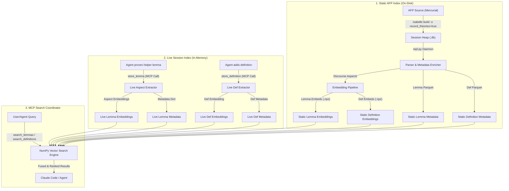
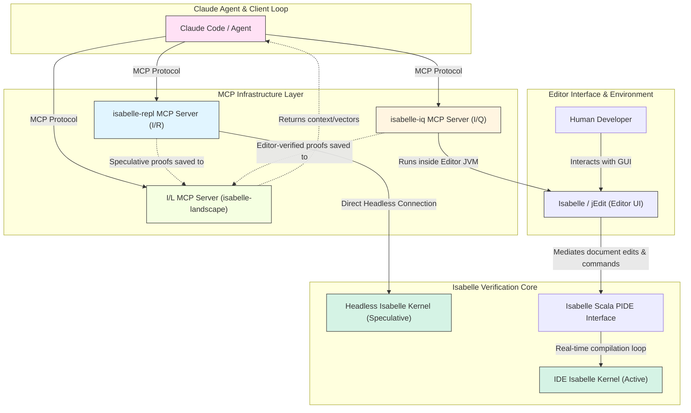

# Technical Report: I/L (Isabelle/Landscape) RAG MCP Server for Isabelle Proof Engineering

This report provides a detailed walkthrough of the implementation, design decisions, and operational details of the **I/L (Isabelle/Landscape) RAG MCP Server** built to assist proof engineering with the **Isabelle/REPL (I/R)** and **Isabelle/Query (I/Q)** agents.

---

## 1. System Architecture & Overview

The I/L (Isabelle/Landscape) system is a Retrieval-Augmented Generation (RAG) assistant that addresses a critical bottleneck in the agent's workflow: token exhaustion and the loss of session context. 

Previously, when the agent attempted a proof, it spent thousands of tokens searching for lemma context and frequently reinvented the wheel by forgetting facts it had already proved in the same session. I/L resolves this via a **two-tier vector index architecture** partitioned into a **Lemma Space** and a **Definition Space**:



### The Two-Tier Index Structure
* **Static AFP Index**: Contains pre-computed aspect embeddings of thousands of lemmas from the Archive of Formal Proofs (AFP) and Isabelle’s standard libraries (e.g. `HOL-Library`). These are compiled offline, serialized as compressed NumPy arrays (`.npz`) and metadata tables (`.parquet`), and loaded into memory on server startup.
* **Live Session Index**: A lightweight, in-memory index that grows dynamically. Whenever the agent successfully completes a proof step, it calls `store_lemma` or `store_definition`, which extracts, embeds, and indexes the new item on the fly. Subsequent searches query both indices, merging and ranking results by cosine similarity.
* **On-Disk Persistence**: To bridge the gap between temporary session-scoped storage and permanent reuse, the system exposes a mechanism to merge the live in-memory session index directly into the static on-disk index via the `persist_session_lemmas` tool. This appends the new lemmas' and definitions' metadata to the static `.parquet` files and stacks their embeddings into the static `.npz` files, ensuring they are loaded in all future agent sessions.

---

## 2. Ingestion Pipeline: Parsing the AFP with Isabelle & REPL

The offline ingestion pipeline extracts structured data from formal proof files. Because Isabelle theories are highly context-sensitive and rely on complex notation, standard text parsers are inadequate. Instead, I/L queries a running **Isabelle Prover session** directly to reconstruct how theories are structured.

### Step 2.1: Building Heaps with Recorded Proof States
By default, Isabelle compiles theories into binary heaps to speed up loading. To parse command boundaries and intermediate states, the sessions must be compiled with the `record_theories` option enabled:
```bash
isabelle build -b -o record_theories=true -d /path/to/edel/external/afp-2025-2/thys -j 8 HOL-Library
```
This tells the Isabelle kernel to record command-by-command source spans and proof state locations inside a SQLite database (`.db`) file adjacent to the PolyML heap.

### Step 2.2: Interacting with the REPL Daemon
We run the Isabelle/REPL daemon (`AutoCorrode/ir/repl.py`) against the compiled heap. The ingestion pipeline connects to this daemon using a TCP socket-based client (`EphemeralReplClient` in [ingest.py](file:///home/correia/edel/edel/il/ingest.py)). 

1. **Retrieve Theories**: The client queries `Ir.theories ();` to list all loaded theories.
2. **Fetch Source Spans**: For each theory, the client runs:
   ```ml
   Ir.source "Theory_Name" 0 ~1;
   ```
   This returns the **entire tokenized source code of the theory file** split into command segments, separated by YXML markup delimiters. Each line contains a leading segment index prefix (e.g., `   2  lemma test1 [simp]: ...`).
3. **Fetch Source Map**: The client requests the structural metadata:
   ```ml
   Ir.source_map "Theory_Name" 0 ~1;
   ```
   This returns a mapping of command indices to keywords, line numbers, offsets, and source files.

### Step 2.3: Grouping Segments into Lemma and Definition Units
Using the source map and segments, the parser (`edel/il/parser.py`) groups sequential commands into logical lemmas and definitions using a state machine:
* **Segment Parsing**: The parser processes the raw string returned by `Ir.source` using regular expressions:
  * `re.match(r'^(\d+)\s', plain)` is used on each line to locate the start of a segment via its index prefix.
  * `re.sub(r'^\s*\d+\s{1,2}', '', ...)` is applied to strip the index prefix from the line, isolating the actual Isabelle source code.
* **Start of an Ingestion Unit**: Detected when a keyword in the source map belongs to either lemmas (`lemma`, `theorem`, `corollary`, `proposition`, `schematic_goal`) or definitions (`definition`, `fun`, `primrec`, `function`, `datatype`, `type_synonym`, `inductive`, `coinductive`, `record`, `abbreviation`).
* **Name Extraction**: Formal names are extracted from the normalized declaration statement using:
  * `extract_lemma_name`: Uses `re.match(r'^(?:lemma|theorem|corollary|proposition|schematic_goal)\s+([a-zA-Z0-9_\'\.]+)(?:\s+\[[^\]]*\])?\s*:', stmt)` to extract names (e.g., `test1` from `lemma test1 [simp]: ...`).
  * `extract_definition_name`: Uses `re.match(rf'^(?:{keyword})\s+([a-zA-Z0-9_\'\.]+)', stmt)` to extract definition/function names (e.g., `test2` from `definition test2 where ...`).
  * If unnamed, a placeholder like `keyword_startoffset` is generated.
* **Proof Collection (for Lemmas)**: Subsequent segments containing proof commands (`by`, `apply`, `proof`, `qed`, `sorry`, `oops`, `done`, `using`, `unfolding`, `from`, `with`, `then`, `hence`, `thus`, `note`, `done`) are gathered as the proof's source code.
* **Termination**: The unit terminates when a finalizing proof command (such as `by`, `qed`, `sorry`, or `oops`) is encountered, or when a new top-level declaration keyword (like `definition`, `fun`, or another `lemma`) begins.

### Step 2.4: Enriching with AFP TOML Metadata
For theories originating in the AFP, the entry name (e.g. `Multiset_Ordering_NPC`) is extracted from the theory name prefix. The `AFPMetadataParser` ([metadata.py](file:///home/correia/edel/edel/il/metadata.py)) parses the corresponding TOML file under `metadata/entries/{entry_name}.toml` to extract entry-level metadata (title, abstract, topics, and authors) which are appended to the lemma's semantic context.

---

## 3. Defining The Four Proof-Oriented Aspects (Choice B)

Isabelle lemmas are embedded into four semantic aspects that form an **epistemic trajectory** through concept space. The four aspects represent the genuinely distinct discourse domains of mathematical proof reasoning — not as a chronological narrative of proof composition, but as the four independent dimensions of mathematical knowledge encoded in a theorem.

Each consecutive pair of aspect embeddings defines a **displacement operator** ($D$). These operators are the primary analytic objects in EDEL theory, measuring the semantic distance traversed between phases of the reasoning process.

```
emb_P ──(D_pm)──► emb_M ──(D_mf)──► emb_F ──(D_fi)──► emb_I
  │                                                        │
  └────────────────── D_pi (epistemic closure) ────────────┘
```

The four aspects are extracted as follows:

### 1. `problem` — Premises / Hypotheses (aspect='premises')
* **Content**: The formal antecedents of the lemma — everything the prover must assume for the result to hold.
* **Examples**:
  * `lemma foo: "count A x = count B x ⟹ x ∈# A ⟹ A = B"` $\to$ `problem = "count A x = count B x, x ∈# A"`
  * `theorem bar: assumes "P" and "Q" shows "R"` $\to$ `problem = "P, Q"`
  * `lemma baz: "∀x. f x = g x"` (unconditional) $\to$ `problem = "none"`
* **Extraction**: Parsed from the lemma's statement without REPL interaction. For the `⟹`-chain form, all but the last top-level conjunct are premises. For the Isar `assumes`/`shows` form, the `assumes` clauses are collected. Unconditional lemmas use the string `"none"` (which maps to a zero vector).
* **Justification**: The premises define the *conditions* required to apply this lemma — the starting point of the theorem's epistemic content. Separating them from the conclusion is essential so that $D_{pi}$ measures the full implication as a directed vector rather than a narrowing within a compound embedding.

### 2. `method` — Proof Skeleton (aspect='skeleton')
* **Content**: The **declarative** layer of the proof — the intermediate claims, equational chains, case splits, and variable introductions made explicit by the prover.
* **Isar keywords that produce method segments**: `proof`, `qed`, `have`, `show`, `also`, `finally`, `next`, `case`, `assume`, `fix`, `obtain`, `define`, `let`.
* **Example**:
  ```isabelle
  proof-
    have "(A2 ∪# ((A1 ∪# (X -# c1)) -# c2)) = (A2 ∪# (A1 ∪# ((X -# c1) -# c2)))"
    also have "... = (A1 ∪# ((A2 ∪# (X -# c2)) -# c1))"
    finally show ?thesis
  qed
  ```
* **Extraction**: The Isabelle REPL's `Ir.source_map` assigns a keyword to every proof segment. Segments whose keyword is in the skeleton set above are routed to `method`.
* **Degenerate case**: One-liner proofs (`by simp`, `apply auto`) produce no skeleton segments. `method = ""` for these lemmas — which is semantically correct: a flat proof has no intermediate structure to record.
* **Justification**: The proof skeleton is the *declarative map* of the proof — what the prover claims step-by-step, independent of how those claims are verified. It is drawn from a fundamentally different vocabulary (Isabelle mathematical propositions) than the tactic layer, ensuring $D_{mf}$ has genuine variance.

### 3. `finding` — Tactic Application (aspect='tactics')
* **Content**: The **operational** layer of the proof — the specific tactics, automation invocations, fact citations, and chaining operations used to actually close each goal.
* **Isar keywords that produce finding segments**: `apply`, `by`, `using`, `unfolding`, `from`, `with`, `then`, `hence`, `thus`, `note`, `done`, `sorry`, `oops`.
* **Example**:
  ```isabelle
  using assms by auto
  using assms by auto
  by auto
  ```
* **Extraction**: Same `seg_map` keyword filter as method — segments with operational keywords are routed to `finding`.
* **Degenerate case**: Definitions and axioms have no proof body, so `finding = ""`.
* **Justification**: The tactic layer captures *how* the proof was mechanically realised. It occupies a distinct semantic space from both the skeleton (mathematical propositions) and the premises/conclusion (the theorem's content). The $D_{mf}$ operator measures how abstractly the automation relates to the claimed intermediate steps.

### 4. `interpretation` — Conclusion (aspect='conclusion')
* **Content**: The formal consequent of the lemma — the mathematical result that holds if all premises are satisfied.
* **Examples**:
  * `lemma "count A x = count B x ⟹ A = B"` $\to$ `interpretation = "A = B"`
  * `theorem: assumes "P" shows "Q"` $\to$ `interpretation = "Q"`
  * `lemma "∀x. f x = g x"` (unconditional) $\to$ `interpretation = "∀x. f x = g x"`
* **Extraction**: Parsed from the statement without REPL interaction. For the `⟹`-chain form, the last top-level conjunct is the conclusion. For `assumes`/`shows`, the `shows` clause is taken. For unconditional lemmas, the entire proposition is the conclusion.
* **Justification**: The conclusion is the *result* the theorem establishes — what the agent gains by successfully applying it. It is always non-empty and is semantically distinct from the premises for any non-trivial theorem.

---

## 4. The Epistemic Closure Operator: $D_{pi}$

The key insight of this design is that the full proposition `premises ⟹ conclusion` is encoded not as a **single embedding point** but as a **directed displacement vector**:

$$\mathbf{D}_{pi} = \mathbf{emb}_{\text{conclusion}} - \mathbf{emb}_{\text{premises}}$$

This is the **implication vector** of the theorem — a geometric object representing the full semantic leap from conditions to achievement.

**Properties**:
* $\|\mathbf{D}_{pi}\|$ = **implication strength** / epistemic closure distance.
  * Near zero $\to$ trivial consequence (conclusion is semantically close to premises).
  * Large $\to$ bridging theorem (conclusion is far from premises; premises and conclusion live in different mathematical domains).
* Two lemmas with the same premises but different conclusions: identical $\mathbf{emb}_{P}$, different $\mathbf{D}_{pi}$ directions — correctly distinguishable.
* Two lemmas with the same conclusion but different premises: identical $\mathbf{emb}_{I}$, different $\mathbf{D}_{pi}$ directions — also correctly distinguishable.
* A single full-statement embedding would conflate both cases.

For **unconditional lemmas** (no premises, $\mathbf{emb}_{P} = \mathbf{0}$):

$$\mathbf{D}_{pi} = \mathbf{emb}_{\text{conclusion}}$$

The result holds without any epistemic precondition. The magnitude measures how "peripheral" or "specific" the conclusion is relative to the centroid of the embedding space.

### Operator Semantics

| Operator | Formula | Interpretation |
| :--- | :--- | :--- |
| $\mathbf{D}_{pm}$ | $\|\mathbf{emb}_{\text{skeleton}} - \mathbf{emb}_{\text{premises}}\|$ | How far the proof's intermediate structure departs from the stated conditions. High = proof introduces claims not directly reflected in the hypotheses. |
| $\mathbf{D}_{mf}$ | $\|\mathbf{emb}_{\text{tactics}} - \mathbf{emb}_{\text{skeleton}}\|$ | How abstractly the automation relates to the declared structure. High = skeleton claims specific things; tactics close them by opaque automation. Low = tactics follow transparently from the skeleton. |
| $\mathbf{D}_{fi}$ | $\|\mathbf{emb}_{\text{conclusion}} - \mathbf{emb}_{\text{tactics}}\|$ | Proof harvest — how far the conclusion reaches beyond the tactic machinery. High = narrow tactics yield a broad result. |
| $\mathbf{D}_{pi}$ | $\|\mathbf{emb}_{\text{conclusion}} - \mathbf{emb}_{\text{premises}}\|$ | **Implication strength / epistemic closure.** The primary characterisation of the theorem's significance. |

---

## 5. Partitioned Definition Space

To prevent search pollution, definitions (e.g. `definition`, `fun`, `primrec`, `abbreviation`) are partitioned completely away from the Lemma Space into their own space. Definitions do not have proofs, skeletons, or tactics, making a 4-aspect representation inappropriate.

Instead, each definition record is stored with:
1. **statement**: Verbatim statement/equation of the definition.
2. **theory**: The name of the source theory.
3. **dependents**: A comma-separated list of lemmas in the session/archive that cite or use this definition (dynamic reverse dependency mapping).

The Definition Space is embedded as a single semantic entity based on the definition's statement and name. Agents can search definitions semantically to locate definition names, equations, and types, and trace their usage examples by reviewing the dependents list.

---

## 6. Extraction Summary

| Aspect | Source | REPL Required? |
|:-------|:-------|:---------------|
| `problem` (Premises) | Parse `statement_text` for `⟹` antecedents or `assumes` clauses | No |
| `method` (Skeleton) | `Ir.source_map` segments with keywords: `have`, `show`, `also`, `case`, `fix`, `obtain`, `proof`, `qed`, etc. | Yes (source map) |
| `finding` (Tactics) | `Ir.source_map` segments with keywords: `apply`, `by`, `using`, `unfolding`, `from`, `then`, `hence`, etc. | Yes (source map) |
| `interpretation` (Conclusion) | Parse `statement_text` for last `⟹` consequent or `shows` clause | No |

**Metadata (stored but not embedded)**:
* `statement_text` — full verbatim proposition for display in search results
* `cited_deps` / `dependents` — identifiers cited in proof or definitions that depend on it
* `theory` — name of the theory hosting the lemma (no natural language construction; just the raw theory name)

---

## 7. Exposed MCP Tools & Computational Profiles

The I/L server exposes six tools and one prompt to the agent:

| Tool Name | Input Arguments | Search Target | Computational Profile | Memory Profile |
| :--- | :--- | :--- | :--- | :--- |
| `search_lemmas` | `query` (str)<br>`aspect` (str)<br>`theory_filter` (str)<br>`max_results` (int) | Lemma Space by aspect (`premises`, `skeleton`, `tactics`, `conclusion`, `all`). | **1 API call** (query embedding).<br>Cosine similarity: $O(N \cdot D)$ matrix multiply.<br>Sorting: $O(N \log N)$ (typically <5ms via NumPy). | Shared memory footprint: ~2.45 GB for full AFP index (150K lemmas at $D=1024$). |
| `search_definitions` | `query` (str)<br>`theory_filter` (str)<br>`max_results` (int) | Definition Space (semantic match on statement). | **1 API call** (query embedding).<br>Cosine similarity search on definition vectors. | Lightweight: ~300 MB for definitions index. |
| `related_lemmas` | `lemma_name` (str)<br>`max_results` (int) | Lemma Space (queries statement index using reference vector). | **0 API calls** (retrieves cached vector).<br>Cosine similarity search.<br>Zero token cost and extremely fast. | Shared memory footprint. |
| `store_lemma` | `name` (str)<br>`statement` (str)<br>`proof_text` (str)<br>`theory` (str)<br>`dependencies` (list) | Appends to live Lemma Space. | **4 API calls** (one embedding per aspect).<br>Aspect extraction: $O(\text{len}(\text{proof}))$.<br>Append: $O(1)$ operations. | Inserts one dictionary and 4 vectors ($4 \times 1024 \times 4$ bytes $\approx 16$ KB per lemma). |
| `store_definition` | `name` (str)<br>`statement` (str)<br>`theory` (str)<br>`dependents` (list) | Appends to live Definition Space. | **1 API call** (definition statement embedding).<br>Append: $O(1)$ operations. | Inserts one dictionary and 1 vector (~4 KB). |
| `session_lemmas` | *None* | Lists all session lemmas and definitions. | $O(L)$ where $L$ is number of stored session items. | Negligible. |
| `persist_session_lemmas` | *None* | Saves live lemmas/definitions to static files on disk. | **0 API calls**.<br>Merges metadata list and vertically stacks NumPy embedding arrays. | Empties in-memory session index. Saves parquet/npz to disk. |

### Exposed MCP Prompt
* `il_proof_strategy`: Explains the I/L (Isabelle/Landscape) structure, how to run discourse transitions (cross-space queries), how to query definitions semantically, and how to utilize definition dependents to find usage examples.

---

## 8. How to Run the MCP Server and Connect to Claude Code

To run the complete system, both the active prover (REPL) and the semantic RAG index must run concurrently. Claude Code connects to both via standard Input/Output pipelines.

### Step 8.1: Start the I/R REPL Daemon
Ensure the recorded heap for your target session (e.g. `HOL-Library`) is built, then launch the REPL server:
```bash
python AutoCorrode/ir/repl.py \
  --isabelle /path/to/Isabelle2025-2/bin/isabelle \
  --session HOL-Library \
  --mcp
```
*Make a note of the TCP authentication token printed in the terminal (e.g. `IR_Repl.token: abc123xyz`).*

### Step 8.2: Build the Static RAG Index (Optional)
If a pre-built index does not exist, build one for your target theories:
```bash
export IR_AUTH_TOKEN="abc123xyz"
export VOYAGE_API_KEY="your-voyage-api-key"

python -m edel.il.build_il_index \
  --provider voyage \
  --model voyage-code-3 \
  --filter "Multiset" \
  --output artifacts/rag_index
```

### Step 8.3: Configure the MCP Client
Add both servers to your Claude Code configuration file (located at `~/.config/claude/mcp_config.json`):

```json
{
  "mcpServers": {
    "isabelle-repl": {
      "command": "/home/correia/miniforge3/envs/edel/bin/python",
      "args": [
        "/home/correia/edel/AutoCorrode/ir/repl.py",
        "--isabelle", "/home/correia/Isabelle2025-2/bin/isabelle",
        "--session", "HOL-Library",
        "--mcp"
      ]
    },
    "isabelle-landscape": {
      "command": "/home/correia/miniforge3/envs/edel/bin/python",
      "args": ["-m", "edel.il.il_server"],
      "env": {
        "VOYAGE_API_KEY": "your-voyage-api-key",
        "IL_EMBEDDING_PROVIDER": "voyage",
        "IL_EMBEDDING_MODEL": "voyage-code-3",
        "IL_INDEX_DIR": "/home/correia/edel/artifacts/rag_index",
        "PYTHONPATH": "/home/correia/edel"
      }
    }
  }
}
```

### Step 8.4: Run the Assistant
Launch the Claude Code CLI:
```bash
claude
```
Claude will connect to both MCP servers. You can now use the dual-loop workflow:
1. **Search**: The agent calls `search_lemmas` to locate similar lemmas in the static index using target aspects.
2. **Strategy**: The agent queries definitions via `search_definitions` or uses cross-space transitions to find tactics.
3. **Proof**: The agent calls `isabelle-repl` tools (e.g., `step_proof`) to execute the proof on the live prover.
4. **Store**: Upon success, the agent calls `store_lemma` or `store_definition` to update the session index, making it immediately available for future proofs.

---

## 9. Multi-Server Collaboration & Human-in-the-Loop Integration (I/Q, I/R, and I/L)

Expanding the agent's environment to connect concurrently to **three MCP servers**—I/L (`isabelle-landscape`), I/R (`isabelle-repl`), and I/Q (`isabelle-iq`)—creates a complete human-in-the-loop proof engineering suite. 

The essential difference between the I/R and I/Q pathways lies in their relationship with the Isabelle Kernel and the user's active editor environment:

* **Isabelle/REPL (I/R - Headless/Direct)**: The agent has a **direct, unmediated TCP socket connection** to the standalone Isabelle kernel daemon. This bypasses the editor entirely, allowing Claude to run high-speed, head-down speculative proofs in an isolated sandbox. This is ideal for checking alternative proof trees or performing heavy batch processing without cluttering the human's active workspace.
* **Isabelle/Query & Assistant (I/Q - Editor-Mediated)**: The `isabelle-iq` MCP server runs **inside the editor's JVM process** (e.g., jEdit or VS Code). Claude cannot access the Isabelle Kernel directly here; instead, all queries and edits must flow through the editor GUI buffers. jEdit acts as a coordinator, managing document modifications and forwarding verified spans to the Isabelle Kernel via the Scala PIDE interface. This architecture is what enables true human-in-the-loop collaboration: the human and agent co-author the same theory buffer, with jEdit maintaining visual synchronization and compile-state markers.

### Dataflow Architecture

The following diagram illustrates how the three servers, the Isabelle kernels, jEdit, and the agent collaborate:



### Collaborative Workflow Dynamic

This tri-server setup enables the agent to act as a partner in a shared workflow:

1. **Introspection**: The agent reads the user's current goal state using `isabelle-iq` (`get_goal_state`).
2. **Contextual Search**: The agent queries I/L to fetch structurally relevant lemmas (by conclusion/premise aspect matching) and definitions.
3. **Speculative Proving**: Claude tests potential proof strategies in the background via the headless `isabelle-repl` sandbox.
4. **Editor Integration**: Once a strategy succeeds, Claude calls `isabelle-iq` to apply the solution directly to the user's active editor buffer via `edit_theory`. The human inspects the change, refines it if necessary, and saves the file.
5. **Memory Update**: Either the agent (via automated post-proof handlers) or the human invokes `store_lemma`/`store_definition` to inject the new verified results into the I/L session index, extending the system's memory for subsequent proof goals.
