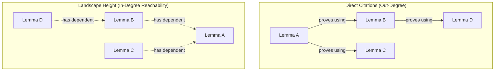

# Analysis Report: Lemma Dependency Extraction & Landscape Height Integration in I/L

This report details how the **Isabelle/Landscape (I/L)** RAG system can extract theorem dependencies in Isabelle and leverage the concept of **Landscape Height**—the count of transitive dependents of a lemma—as a proxy for its *epistemic significance* to improve proof search and reasoning.

---

## 1. The Epistemic Landscape: Why Height Matters

In formal mathematics, not all proven lemmas are created equal:
* **Obscure Lemmas**: Many theorems are proved simply as intermediate helper lemmas. They are highly specialized and never cited again.
* **Foundational Lemmas**: Theorems like `HOL.List.append_assoc` or `HOL-Library.Multiset.union_commute` are cited hundreds of times across different libraries.

Currently, semantic search on aspect vectors (cosine similarity) treats all lemmas equally. If a query matches an obscure, helper lemma with a cosine similarity of `0.85` and a foundational, widely-applicable lemma with a similarity of `0.84`, the search coordinator will return the obscure one first. 

By measuring the **Landscape Height** (transitive reachability in the dependency graph), the RAG server can bias search results to prefer widely trusted, foundational theorems when semantic similarity is close.

---

## 2. Isabelle Dependency Extraction Pathways

There are three primary pathways to extract dependencies between Isabelle theorems:

```
                  ┌──────────────────────────────────────────┐
                  │ Isabelle Theorem Dependency Extraction   │
                  └────────────────────┬─────────────────────┘
                                       │
         ┌─────────────────────────────┼──────────────────────────────┐
         ▼                             ▼                              ▼
┌──────────────────┐         ┌───────────────────┐         ┌────────────────────┐
│ 1. Isar-Level    │         │ 2. Kernel-Level   │         │ 3. Editor-Level    │
│ Parsed Citations │         │ Proof Derivations │         │ Scala PIDE Links   │
└────────┬─────────┘         └─────────┬─────────┘         └──────────┬─────────┘
         │                             │                              │
         ▼                             ▼                              ▼
* Parses proofs for          * Inspects PolyML proof       * Monitors real-time
  lemma/fact names             objects (`Thm.deriv_of`)      hyperlink markers
* Fast, lightweight,         * 100% complete & sound       * Tied to editor UI;
  captures user intent       * Verbose, includes logic     * Hard to run in
* Misses implicit rules        axioms and library details    headless batch scripts
```

### Pathway 2.1: Isar-Level Parsed Citations (Recommended)
This is the approach currently initiated by our `edel.il.parser` and REPL commands. By parsing proof scripts for named citations in commands like `by (simp add: foo)`, `using bar`, or `from baz`, we capture **direct user-level citations**.
* **Pros**: High semantic signal. It captures exactly what the mathematician explicitly cited, ignoring low-level compiler-inserted logical rules.
* **Cons**: Misses implicit dependencies (e.g., lemmas automatically applied by the simplifier or classical reasoner that were not named in the source file).

### Pathway 2.2: Kernel-Level Proof Derivations (`Thm.deriv_of`) with Index-Based Filtering
Isabelle keeps track of proof derivations in Poly/ML. When proofs are recorded (`record_theories=true`), every `thm` object contains a derivation tree.
* In Poly/ML, we can query:
  ```ml
  val deriv = Thm.deriv_of thm;
  ```
  This returns a `deriv` tree structure containing the names of all theorems referenced during the kernel-level verification of the proof.
* **Filtering Primitives**: The raw derivation tree is extremely verbose, containing thousands of low-level logical rules (e.g., `Pure.conjI`, `Pure.trans`, `HOL.refl`). To eliminate this noise, we perform **Index-Key Membership Filtering**:
  * We compare each name in the derivation tree against the set of keys/titles in our **Lemma and Definition indices**.
  * Since only mathematically significant lemmas/definitions from `HOL-Library` or the AFP have their own 3-simplex (or definition record) indexed, we discard any derivation name that is not present in the index.
* **Pros**: 100% sound and complete (captures implicit simplifier/solver facts) while completely filtering out logical primitives and metadata noise.
* **Cons**: Requires the static index to be loaded first, or requires a predefined whitelist of theory namespaces (e.g. only matching names starting with `HOL-Library.` or an AFP entry name).

### Pathway 2.3: Editor-Level Scala PIDE Links
The Isabelle/jEdit PIDE editor matches formal names to their definitions and proofs using Scala markup trees.
* When a user hovers over a theorem name in a proof, PIDE resolves its declaration location using active hyperlink markers.
* **Pros**: Highly accurate.
* **Cons**: Strongly coupled to the editor's active JVM buffer states. Running this in headless, automated batch scripts (like our offline AFP index builder) is highly inefficient and difficult to coordinate.

---

## 3. Calculating Landscape Height: Graph Topology

Once direct citations are extracted (either via Isar parsing or kernel derivations), we construct the global **Landscape DAG** (Directed Acyclic Graph):

1. **Nodes ($V$)**: All lemmas and definitions in the AFP.
2. **Edges ($E$)**: A directed edge $A \to B$ exists if lemma $A$ directly cites lemma $B$ in its proof.
3. **Transpose Edges ($E^T$)**: Invert the edges: $B \to A$. An edge exists from $B$ to $A$ if $B$ is a dependency of $A$.



### The Reachability Count Algorithm
For any lemma $L$, its **Landscape Height** $H(L)$ is the number of nodes reachable from $L$ in the transpose graph $G^T$. 
* Since the dependency graph is a DAG, we can compute the transitive closure sizes efficiently:
  * **Topological Sort + Bitsets**: Sort the DAG topologically. For each node, the reachable set of dependents is the union of the reachable sets of its parents. Using bitsets, we can compute this in $O(|V| + |E| + \frac{|V|^2}{64})$ time.
  * **Memoized DFS**: For each node, perform a depth-first search on $G^T$ to accumulate the set of reachable nodes, caching the results to ensure $O(|V| + |E|)$ complexity.

---

## 4. Leveraging Landscape Height in Agent Search

To give the agent the ability to leverage this information, we introduce **Epistemic Bias Re-ranking** in our RAG search coordinator.

### Step 4.1: The Epistemic Log Prior Formula
We define the **Epistemic Prior** ($P$) of a lemma $L$ as the logarithm of its transitive reachability:

$$P(L) = \log(1 + H(L))$$

Using the log-scale prevents extremely common lemmas (with thousands of dependents) from completely dominating the search results, while still providing a clear distinction between a lemma with 0 dependents and a lemma with 100 dependents.

### Step 4.2: Fused Ranking Score
When searching for lemmas, we combine the cosine similarity score ($S_{\text{semantic}}$) and the normalized Epistemic Prior:

$$Score(L) = S_{\text{semantic}}(L) + \lambda \cdot \frac{P(L)}{\max_{x \in V} P(x)}$$

* $\lambda \in [0, 1]$ is the **Epistemic Weight** (default: `0.15`).
* If $\lambda = 0$, the search is purely semantic.
* If $\lambda > 0$, the search is biased towards highly influential lemmas.

### Step 4.3: MCP Tool Integration
We can expose this to the agent through two parameters in `search_lemmas`:
1. `sort_by_significance` (bool): If `true`, applies the fused ranking score. If `false`, uses pure cosine similarity.
2. `min_dependents` (int): Filters out lemmas that have fewer than $K$ direct or transitive dependents (allowing the agent to ignore highly obscure, local helper lemmas when looking for general-purpose rules).

---

## 5. Implementation Roadmap

```mermaid
chronology
    title Implementation Timeline
    section Phase 1: Ingestion
        Enrich ingest.py parser to capture direct citations : 2026-07-10
    section Phase 2: Graph Compilation
        Build graph pipeline to calculate transitive dependents : 2026-07-11
    section Phase 3: Indexing
        Save height column in metadata and load in NumpyRAGIndex : 2026-07-12
    section Phase 4: MCP Search
        Implement fused scoring in search_lemmas and expose to agent : 2026-07-13
```
