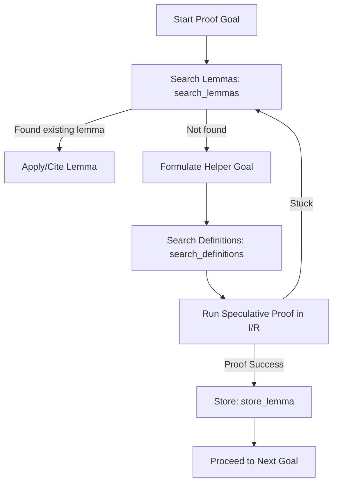

# I/L (Isabelle/Landscape): AI Proof Engineer Guidance

I/L (Isabelle/Landscape) is a specialized Retrieval-Augmented Generation (RAG) system designed to assist the Isabelle agent in finding relevant lemmas, retrieving structured definitions, and preserving the context of newly proven facts during a proof session.

It exposes a set of MCP tools that you should call systematically during proof engineering tasks to minimize token consumption and prevent getting stuck.

---

## Tool Reference

### 1. `search_lemmas`
* **Purpose**: Find relevant lemmas matching a search query by semantic similarity.
* **Arguments**:
  - `query` (str): Natural language or formal Isar goal/statement.
  - `aspect` (str, default: `'conclusion'`): The aspect of the lemma to search over:
    - `'premises'`: Match by hypotheses, preconditions, or assumptions.
    - `'skeleton'`: Match by declarative proof structure (have/show/case).
    - `'tactics'`: Match by operational tactics/commands (apply/by).
    - `'conclusion'`: Match by final goal statement.
    - `'all'`: Combined hybrid search across all aspects.
  - `theory_filter` (str): Optional theory name substring (e.g. `'Multiset'`).
  - `max_results` (int): Maximum matches to return.
* **When to use**: Call this at the start of a proof section to check if the target lemma (or a closely related variant) has already been proven.

### 2. `search_definitions`
* **Purpose**: Search for definitions, types, or abbreviations in the dedicated Definition Space.
* **Arguments**:
  - `query` (str): Semantic text or target name.
  - `theory_filter` (str): Optional theory name substring.
  - `max_results` (int): Number of definitions to return.
* **When to use**: Use this to discover existing definitions, verify their equations, and find their usage examples in the archive.

### 3. `store_lemma`
* **Purpose**: Store a newly proven lemma in the dynamic RAG session index.
* **Arguments**:
  - `name` (str): Name of the proven lemma.
  - `statement` (str): The proven proposition.
  - `proof_text` (str): The full proof script/body.
  - `theory` (str): The theory it belongs to.
  - `cited_deps` (list[str]): Names of lemmas/facts cited in the proof.
* **When to use**: **CRITICAL**. Call this immediately after proving any helper lemma. Storing it ensures it is indexed dynamically, so you can retrieve it later in the same session without "forgetting" your progress or reinventing the wheel.

### 4. `store_definition`
* **Purpose**: Store a new definition in the session Definition Space.
* **Arguments**:
  - `name` (str): Name of the definition.
  - `statement` (str): Statement text/equations.
  - `theory` (str): The theory it belongs to.
  - `dependents` (list[str]): Names of lemmas in the session that depend on it.

### 5. `related_lemmas`
* **Purpose**: Find lemmas semantically similar to a known lemma by its title (e.g., `'HOL.List.append_Nil'`).
* **Arguments**:
  - `lemma_name` (str): Title of the reference lemma.
  - `max_results` (int): Number of matches.

### 6. `session_lemmas`
* **Purpose**: List all lemmas and definitions stored dynamically in the session index.

### 7. `persist_session_lemmas`
* **Purpose**: Merge in-memory session lemmas/definitions to the disk-based static index.

---

## Step-by-Step Proof Workflow

Follow this loop for every proof task:



---

## Configuration & Launch

To start the server, define the following environment variables:

```bash
export OPENAI_API_KEY="your-openai-key"
# or
export VOYAGE_API_KEY="your-voyage-key"
export IL_EMBEDDING_PROVIDER="voyage" # "voyage" or "openai"
export IL_EMBEDDING_MODEL="voyage-code-3" # e.g. "voyage-code-3" or "text-embedding-3-large"
export IL_INDEX_DIR="/home/correia/edel/artifacts/rag_index"
```

Add the server to your `mcp_config.json`:

```json
{
  "mcpServers": {
    "isabelle-landscape": {
      "command": "/home/correia/miniforge3/envs/edel/bin/python",
      "args": ["-m", "edel.il.il_server"],
      "env": {
        "OPENAI_API_KEY": "...",
        "VOYAGE_API_KEY": "...",
        "IL_EMBEDDING_PROVIDER": "voyage",
        "IL_EMBEDDING_MODEL": "voyage-code-3",
        "IL_INDEX_DIR": "/home/correia/edel/artifacts/rag_index",
        "PYTHONPATH": "/home/correia/edel"
      }
    }
  }
}
```
