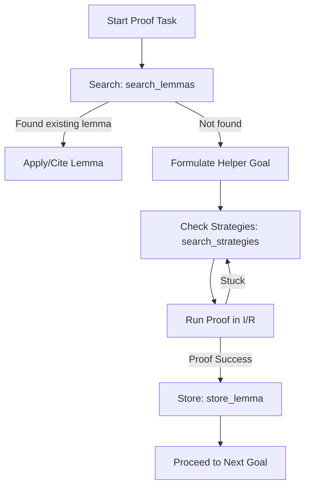

# EDEL-RAG: AI Proof Engineer Guidance

EDEL-RAG is a specialized Retrieval-Augmented Generation (RAG) system designed to assist the Isabelle agent in finding relevant lemmas, reusing successful proof strategies, and preserving context of newly proven facts during a proof session.

It exposes a set of MCP tools that you should call systematically during proof engineering tasks to minimize token consumption and prevent getting stuck.

---

## Tool Reference

### 1. `search_lemmas`
* **Purpose**: Find relevant lemmas matching a search query by semantic similarity.
* **Arguments**:
  - `query` (str): Natural language or formal Isar goal/statement.
  - `aspect` (str, default: `'statement'`): The aspect of the lemma to search over:
    - `'statement'`: Match by goal structure/proposition.
    - `'context'`: Match by theory topics, session titles, or abstracts.
    - `'strategy'`: Match by proof methods/scripts.
    - `'dependencies'`: Match by cited lemmas/facts.
    - `'all'`: Combined hybrid search across all aspects.
  - `theory_filter` (str): Optional theory name substring (e.g. `'Multiset'`).
  - `max_results` (int): Maximum matches to return.
* **When to use**: Call this at the start of a proof section to check if the target lemma (or a closely related variant) has already been proven in the AFP.

### 2. `search_strategies`
* **Purpose**: Find proof strategies that worked for goals similar to the query goal.
* **Arguments**:
  - `goal` (str): The formal proposition of the goal you are trying to prove.
  - `max_results` (int): Number of strategy recommendations to return.
* **When to use**: Use this when you are unsure how to approach a goal, or when simple automation (`simp`, `auto`, `blast`) fails. It suggests specific methods (e.g. `induction`, `metis`) with confidence scores and concrete example lemmas that used them.

### 3. `store_lemma`
* **Purpose**: Store a newly proven lemma in the RAG session index.
* **Arguments**:
  - `name` (str): Name of the proven lemma.
  - `statement` (str): The proven proposition.
  - `proof_text` (str): The full proof script/body.
  - `theory` (str): The theory it belongs to.
  - `dependencies` (list[str]): Names of lemmas/facts cited in the proof.
* **When to use**: **CRITICAL**. Call this immediately after proving any helper lemma. Storing it ensures it is indexed dynamically, so you can retrieve it later in the same session without "forgetting" your progress or reinventing the wheel.

### 4. `related_lemmas`
* **Purpose**: Find lemmas semantically similar to a known lemma by its title (e.g., `'HOL.List.append_Nil'`).
* **Arguments**:
  - `lemma_name` (str): Title of the reference lemma.
  - `max_results` (int): Number of matches.
* **When to use**: Useful when you know one relevant lemma and want to discover other closely related lemmas in the same theory or AFP entry.

### 5. `session_lemmas`
* **Purpose**: List all lemmas stored dynamically in the session index.
* **When to use**: Run this to review what has been proved so far in the current session.

---

## Step-by-Step Proof Workflow

Follow this loop for every proof task:



1. **Search First**: Before starting a proof, run `search_lemmas` with the goal.
2. **Find Strategy**: If you need to prove a helper lemma, run `search_strategies` with the goal to identify the right induction variables or proof methods.
3. **Register Live**: As soon as `I/R` accepts the proof, call `store_lemma`.

---

## Configuration & Launch

To start the server, define the following environment variables:

```bash
export OPENAI_API_KEY="your-openai-key"
# or
export VOYAGE_API_KEY="your-voyage-key"
export EDEL_EMBEDDING_PROVIDER="voyage" # "voyage" or "openai"
export EDEL_EMBEDDING_MODEL="voyage-code-2" # e.g. "voyage-code-2" or "text-embedding-3-large"
export EDEL_RAG_INDEX_DIR="/home/correia/edel/artifacts/rag_index"
```

Add the server to your `mcp_config.json`:

```json
{
  "mcpServers": {
    "edel-rag": {
      "command": "/home/correia/miniforge3/envs/edel/bin/python",
      "args": ["-m", "edel.isabelle.rag_server"],
      "env": {
        "OPENAI_API_KEY": "...",
        "VOYAGE_API_KEY": "...",
        "EDEL_EMBEDDING_PROVIDER": "voyage",
        "EDEL_EMBEDDING_MODEL": "voyage-code-2",
        "EDEL_RAG_INDEX_DIR": "/home/correia/edel/artifacts/rag_index",
        "PYTHONPATH": "/home/correia/edel"
      }
    }
  }
}
```
